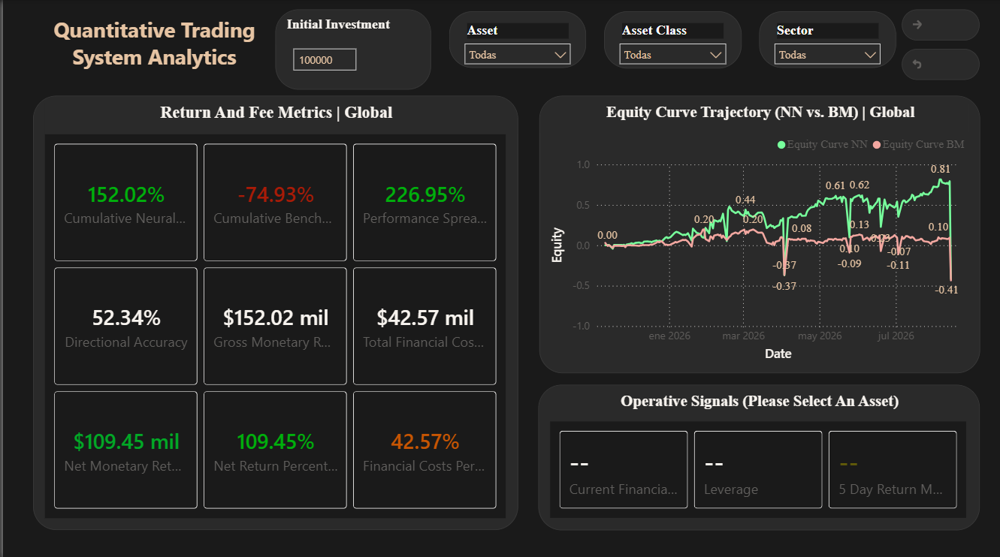

# End_To_End_Adaptive_Quantitative_Trading_System
End-To-End Adaptive Quantitative Trading System combining GRU (Gated-Recurrent-Unit) Neural Networks, SQL Relational Database Architecture and Power BI Analytics.

## Dashboard Preview



## Key Components

- **Adaptive Deep-Learning (Python):** GRU Neural Network Model that dynamically toggles between 10 and 20 day windows according to the volatility regime (Average True Range) of the asset.
- **Realistic Financial Backtesting (Python):** Backtesting system that emulates a real trading market, including trading commisions, interest rate for leveraged positions and loan rates for leveraged short selling. Therefore, the financial earnings and losses obtained are free from unrealistic bias.
- **Risk Management & Adaptive Leverage (Python):** In times of high uncertainty, the model is trained to recommend the user to stay on Cash (0) in order to protect their capital, while using Adaptive Leverage (1.0x to 2.0x) to boost the obtained returns when the model has the most certainty of the tendency of an asset.
- **Data Governance (SQL)**: Star-Schema built databases including dimension and fact tables, unifying local asset prices (MXN) and international asset prices (USD/BTC).
- **Power BI Institutional Analytics (Power BI):** Interactive Dashboard that contains global and filtered results of the model, such as performance attributions, equity curves Neural Network vs Benchmark, risk management metrics by asset and model performance metrics (Model Accuracy %).

## Remarkable Results

| Metric | Neural Network (GRU) | Benchmark | Alpha |
| :--- | :---: | :---: | :---: |
| **Cumulative Global Return** | **+152.02%** | -74.93% | **+226.95%** |
| **Outperformer (GLD)** | **+79.22%** | -4.27% | **+83.49%** |
| **Directional Accuracy** | **52.34%** | N/A | N/A |

## Technology Stack

* **Programming Language:** Python 3.10+
* **Deep-Learning:** Tensorflow/Keras (GRU, Dropout, Dense, Adam, EarlyStopping)
* **Data Processing & Machine Learning (ML):** Pandas, NumPy, Scikit-Learn
* **Databases:** SQL, SQLite3 and SQLAlchemy
* **Business Intelligence:** Power BI (DAX, Visuals, Data Filtering)

## Execution Flow

1. **Data Fetching:** Gross historical data of the list of assets obtained via Yahoo Finance fetched in a Pandas DataFrame and converted in a SQLite3 Database (.db).
2. **SQL Modelling:** SQL query execution to calculate technical indicators on 10 and 20 day windows (Logarithmic Returns, Moving Averages, Volatility, Average True Range, Relative Strength Index and Average Directional Index) and exchange rate conversion.
3. **Model Training:**  GRU-based neural network model trained to analyze portfolio historical data and take a financial position with adaptive leverage according to the volatility of the asset, boosting returns and reducing risk.

```bash
   python 03_Neural_Network_Pipeline/trading_system_neural_network_pipeline.py
 ```

4. **Data Analytics:** Power BI analytics dashboard to demonstrate the financial backtesting results, including metrics such as directional accuracy, net returns and performance spread. Provides investing advice according to the current tendency and equity curve of each asset, with interactive filter menus by asset, asset class and sector.

## Demo Video

[](https://github.com/user-attachments/assets/eb8bc8ee-f144-4807-a4ee-34424be45d6d)
